# ToothTrack Dental Appointment System - Sequence and Swimlane Diagrams

This document contains sequence and swimlane diagrams that illustrate the key workflows and processes in the ToothTrack Dental Appointment System.

## Table of Contents
1. [Sequence Diagrams](#sequence-diagrams)
   - [Patient Appointment Booking](#1-patient-appointment-booking-sequence-diagram)
   - [User Authentication](#2-user-authentication-sequence-diagram)
   - [Dentist Managing Appointment Status](#3-dentist-managing-appointment-status-sequence-diagram)
   - [Patient Record Creation](#4-patient-record-creation-sequence-diagram)
   - [Patient Cancelling Appointment](#5-patient-cancelling-appointment-sequence-diagram)

2. [Swimlane Diagrams](#swimlane-diagrams)
   - [Appointment Booking Process](#1-appointment-booking-process-swimlane-diagram)
   - [Appointment Management Workflow](#2-appointment-management-workflow-swimlane-diagram)
   - [Patient Management Workflow](#3-patient-management-workflow-swimlane-diagram)
   - [User Management Workflow](#4-user-management-workflow-swimlane-diagram)

---

## Sequence Diagrams

### 1. Patient Appointment Booking Sequence Diagram

### 2. User Authentication Sequence Diagram

### 3. Dentist Managing Appointment Status Sequence Diagram

### 4. Patient Record Creation Sequence Diagram

### 5. Patient Cancelling Appointment Sequence Diagram

---

## Swimlane Diagrams

### 1. Appointment Booking Process Swimlane Diagram

### 2. Appointment Management Workflow Swimlane Diagram

```mermaid
flowchart LR
    subgraph DentistLane["👨‍⚕️ DENTIST"]
        direction TB
        D1[View Appointments]
        D2[Select Appointment]
        D3[Update Status]
        D4[Add Notes]
        D5[Save Changes]
        D1 --> D2 --> D3 --> D4 --> D5
    end
    
    subgraph PatientLane["👤 PATIENT"]
        direction TB
        P1[View My Appointments]
        P2[Click Cancel]
        P3[Confirm Cancellation]
        P4[Receive Status Update]
        P1 --> P2 --> P3
    end
    
    subgraph UILane["🖥️ USER INTERFACE"]
        direction TB
        UI1[Display Table]
        UI2[Show Edit Modal]
        UI3[Show Status Options]
        UI4[Show Success]
        UI5[Show Cancel Dialog]
        UI1 --> UI2 --> UI3 --> UI4
        UI1 --> UI5
    end
    
    subgraph SystemLane["⚙️ SYSTEM LOGIC"]
        direction TB
        S1[Load Appointments]
        S2[Filter by Role]
        S3[Check Permissions]
        S4[Validate Change]
        S5[Update Appointment]
        S6[Create Record]
        S7[Create Notification]
        S8[Cancel Appointment]
        S1 --> S2 --> S3 --> S4 --> S5
        S5 --> S6 --> S7
        S3 --> S8 --> S7
    end
    
    subgraph DataLane["💾 DATA MANAGER"]
        direction TB
        DM1[Get Appointments]
        DM2[Filter Data]
        DM3[Update Appointment]
        DM4[Create Record]
        DM5[Create Notification]
        DM1 --> DM2 --> DM3
        DM3 --> DM4 --> DM5
    end
    
    subgraph StorageLane["🗄️ LOCALSTORAGE"]
        direction TB
        LS1[(Appointments)]
        LS2[(Records)]
        LS3[(Notifications)]
    end
    
    D1 -.->|Triggers| UI1
    D2 -.->|Triggers| UI2
    D5 -.->|Triggers| S3
    P1 -.->|Triggers| UI1
    P3 -.->|Triggers| S3
    
    UI1 -.->|Calls| S1
    UI2 -.->|Calls| S3
    UI5 -.->|Calls| S3
    
    S1 -.->|Calls| DM1
    S3 -.->|Calls| DM2
    S5 -.->|Calls| DM3
    S6 -.->|Calls| DM4
    S7 -.->|Calls| DM5
    S8 -.->|Calls| DM3
    
    DM1 <--> LS1
    DM2 <--> LS1
    DM3 <--> LS1
    DM4 <--> LS2
    DM5 <--> LS3
    
    S7 -.->|Notifies| P4
    S7 -.->|Updates| UI4
    UI4 -.->|Shows| D5
```

### 3. Patient Management Workflow Swimlane Diagram

```mermaid
flowchart LR
    subgraph DentistLane["👨‍⚕️ DENTIST"]
        direction TB
        D1[View Patients]
        D2[Select Patient]
        D3[Edit Medical History]
        D4[Save Changes]
        D1 --> D2 --> D3 --> D4
    end
    
    subgraph AdminLane["👨‍💼 ADMIN"]
        direction TB
        A1[View All Patients]
        A2[Click New Patient]
        A3[Fill Patient Info]
        A4[Save Patient]
        A5[Click Delete]
        A6[Confirm Delete]
        A1 --> A2 --> A3 --> A4
        A1 --> A5 --> A6
    end
    
    subgraph PatientLane["👤 PATIENT"]
        direction TB
        P1[View Own Profile]
        P2[Edit Profile]
        P3[Save Changes]
        P1 --> P2 --> P3
    end
    
    subgraph UILane["🖥️ USER INTERFACE"]
        direction TB
        UI1[Display Table]
        UI2[Show Details]
        UI3[Show Edit Form]
        UI4[Show Create Form]
        UI5[Show Success]
        UI6[Show Delete Dialog]
        UI1 --> UI2 --> UI3 --> UI5
        UI1 --> UI4 --> UI5
        UI1 --> UI6 --> UI5
    end
    
    subgraph SystemLane["⚙️ SYSTEM LOGIC"]
        direction TB
        S1[Load Patients]
        S2[Filter by Role]
        S3[Check Permissions]
        S4[Validate Data]
        S5[Create Patient]
        S6[Update Patient]
        S7[Delete Patient]
        S8[Cascade Delete]
        S1 --> S2 --> S3 --> S4
        S4 --> S5
        S4 --> S6
        S3 --> S7 --> S8
    end
    
    subgraph DataLane["💾 DATA MANAGER"]
        direction TB
        DM1[Get Patients]
        DM2[Filter by Appointments]
        DM3[Create Patient]
        DM4[Update Patient]
        DM5[Delete Patient]
        DM6[Delete Appointments]
        DM7[Delete Records]
        DM1 --> DM2 --> DM3
        DM1 --> DM2 --> DM4
        DM1 --> DM5 --> DM6 --> DM7
    end
    
    subgraph StorageLane["🗄️ LOCALSTORAGE"]
        direction TB
        LS1[(Patients)]
        LS2[(Appointments)]
        LS3[(Records)]
    end
    
    D1 -.->|Triggers| UI1
    D4 -.->|Triggers| S3
    A2 -.->|Triggers| UI4
    A4 -.->|Triggers| S3
    A6 -.->|Triggers| S3
    P2 -.->|Triggers| UI3
    P3 -.->|Triggers| S3
    
    UI1 -.->|Calls| S1
    UI3 -.->|Calls| S3
    UI4 -.->|Calls| S3
    UI6 -.->|Calls| S3
    
    S1 -.->|Calls| DM1
    S2 -.->|Calls| DM2
    S5 -.->|Calls| DM3
    S6 -.->|Calls| DM4
    S7 -.->|Calls| DM5
    S8 -.->|Calls| DM6
    S8 -.->|Calls| DM7
    
    DM1 <--> LS1
    DM2 <--> LS2
    DM3 <--> LS1
    DM4 <--> LS1
    DM5 <--> LS1
    DM6 <--> LS2
    DM7 <--> LS3
    
    S5 -.->|Updates| UI5
    S6 -.->|Updates| UI5
    S7 -.->|Updates| UI5
    UI5 -.->|Shows| D4
    UI5 -.->|Shows| A4
    UI5 -.->|Shows| P3
```

### 4. User Management Workflow Swimlane Diagram

```mermaid
flowchart LR
    subgraph AdminLane["👨‍💼 ADMIN"]
        direction TB
        A1[View Users List]
        A2[Click New User]
        A3[Fill User Info]
        A4[Select Role]
        A5[Save User]
        A6[Click Edit]
        A7[Update User]
        A8[Click Delete]
        A9[Confirm Delete]
        A1 --> A2 --> A3 --> A4 --> A5
        A1 --> A6 --> A7
        A1 --> A8 --> A9
    end
    
    subgraph UILane["🖥️ USER INTERFACE"]
        direction TB
        UI1[Display Users Table]
        UI2[Show Create Form]
        UI3[Show Edit Form]
        UI4[Show Role Options]
        UI5[Show Success]
        UI6[Show Delete Dialog]
        UI1 --> UI2 --> UI5
        UI1 --> UI3 --> UI5
        UI1 --> UI6 --> UI5
    end
    
    subgraph SystemLane["⚙️ SYSTEM LOGIC"]
        direction TB
        S1[Load Users]
        S2[Check Admin Permission]
        S3[Validate User Data]
        S4[Check Email Uniqueness]
        S5[Create User]
        S6[Update User]
        S7[Delete User]
        S8[Cascade Delete]
        S1 --> S2 --> S3 --> S4
        S4 --> S5
        S4 --> S6
        S2 --> S7 --> S8
    end
    
    subgraph DataLane["💾 DATA MANAGER"]
        direction TB
        DM1[Get Users]
        DM2[Create User]
        DM3[Update User]
        DM4[Delete User]
        DM5[Delete Appointments]
        DM6[Delete Patients]
        DM7[Delete Records]
        DM8[Delete Settings]
        DM1 --> DM2
        DM1 --> DM3
        DM1 --> DM4 --> DM5 --> DM6 --> DM7 --> DM8
    end
    
    subgraph StorageLane["🗄️ LOCALSTORAGE"]
        direction TB
        LS1[(Users)]
        LS2[(Appointments)]
        LS3[(Patients)]
        LS4[(Records)]
        LS5[(Settings)]
    end
    
    A2 -.->|Triggers| UI2
    A5 -.->|Triggers| S2
    A6 -.->|Triggers| UI3
    A7 -.->|Triggers| S2
    A9 -.->|Triggers| S2
    
    UI1 -.->|Calls| S1
    UI2 -.->|Calls| S2
    UI3 -.->|Calls| S2
    UI6 -.->|Calls| S2
    
    S1 -.->|Calls| DM1
    S4 -.->|Calls| DM1
    S5 -.->|Calls| DM2
    S6 -.->|Calls| DM3
    S7 -.->|Calls| DM4
    S8 -.->|Calls| DM5
    S8 -.->|Calls| DM6
    S8 -.->|Calls| DM7
    S8 -.->|Calls| DM8
    
    DM1 <--> LS1
    DM2 <--> LS1
    DM3 <--> LS1
    DM4 <--> LS1
    DM5 <--> LS2
    DM6 <--> LS3
    DM7 <--> LS4
    DM8 <--> LS5
    
    S5 -.->|Updates| UI5
    S6 -.->|Updates| UI5
    S7 -.->|Updates| UI5
    UI5 -.->|Shows| A5
    UI5 -.->|Shows| A7
    UI5 -.->|Shows| A9
```

---

## Diagram Notes

### Key Components:
- **Patient**: End user who books appointments and manages their profile
- **Dentist**: Healthcare provider who manages appointments and patient records
- **Admin**: System administrator with full access
- **User Interface**: Frontend presentation layer
- **System Logic**: Business logic and validation layer (ViewsHandler, ValidationManager)
- **Data Manager**: Data access layer that handles CRUD operations
- **LocalStorage**: Client-side data persistence
- **RolePermissions**: Access control and permission checking

### Key Workflows:
1. **Appointment Booking**: Multi-step process involving service selection, dentist selection, time slot availability checking, and appointment creation
2. **Authentication**: User login with role-based access control
3. **Appointment Management**: Status updates, cancellations, and notifications
4. **Patient Management**: CRUD operations with role-based filtering
5. **User Management**: Admin-only user account management with cascade deletion

### Data Flow:
- All data operations go through DataManager
- Data is persisted in LocalStorage
- Role-based filtering ensures users only see authorized data
- Notifications are created for important events (new appointments, status changes, cancellations)

### Security Considerations:
- Permission checks are performed at multiple levels
- Role-based access control restricts views and actions
- Data filtering ensures users only access their own or authorized data
- Validation occurs before data persistence

